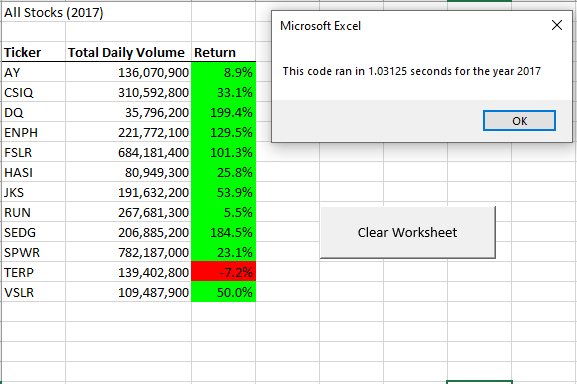
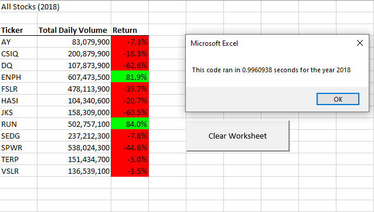
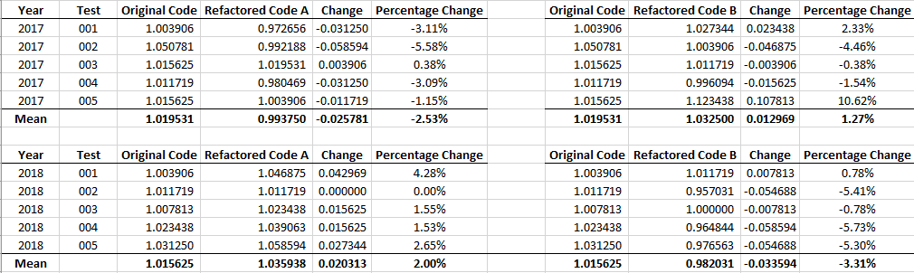

# Module_02_Challenge
Module 02 Challenge - Stock Analysis in VBA

## Overview of Project
Module 2 Challenge. This project involves using VBA within Microsoft Excel to analyze data historical data relating to a selection of stocks.

### Purpose
The purpose of this challenge is to provide the end user with the total number of shares traded and the annual percentage return (or loss) for a selection of stocks for a specified year.  

## Results
The overwhelming majority of the stocks included in this analysis performed significantly better in 2017 than in 2018; for 2017, only one stock (TERP) failed to appreciate in value over the course of the year, while in 2018, only two stocks (RUN and ENPH) appreciated in value, with each of the other stocks we analyzed finishing the year well below their per-share price to begin the year.     

### Tables Detailing Annualized Performance

## Refactoring Code
As part of this assignment, the code that was originally written earlier in the module was refactored in an attempt to improve performance; the primary change in approach related to the use of additional arrays to store values for tickers, tickerVolumes, tickerStartingPrices and tickerEndingPrices.

### Original Code - green_stocks.xslm
    'Create Variables for Starting and Ending Prices
    Dim startingPrice As Single
    Dim endingPrice As Single
    
    'Activate Data Worksheet
    'Worksheets("2018").Activate
    Sheets(yearValue).Activate
    
    'Get Number of Rows to Loop Through
    RowCount = Cells(Rows.Count, "A").End(xlUp).Row
    
    'Loop Through Tickers
    
    For i = 0 To 11
    
        ticker = tickers(i)
        totalVolume = 0
        
        'Activate Data Worksheet
        'Worksheets("2018").Activate
        Sheets(yearValue).Activate
                
        'Loop Through Rows in Data
        For j = 2 To RowCount

### Refactored Code
Multiple approaches were utilized while attempting to refactor the original code - the primary difference between the two approaches is in the iterator that is utilized to loop through each of the tickers - Approach A utilizes i as an iterator to control the loop, whereas Approach B uses the existing tickerIndex variable to control the loop. 

**Attempt A**

'Activate Data Worksheet
    Worksheets(yearValue).Activate
    
    'Get Number of Rows to Loop Through
    RowCount = Cells(Rows.Count, "A").End(xlUp).Row
    
    'Create tickerIndex
    Dim tickerIndex As Integer
    
    'Create Output Arrays
    Dim tickerVolumes(12) As Long
    Dim tickerStartingPrices(12) As Single
    Dim tickerEndingPrices(12) As Single
      
    'Loop Through Tickers
    
    For i = 0 To 11
       
        ticker = tickers(tickerIndex)
        tickerVolumes(tickerIndex) = 0
        
        'Activate Data Worksheet
        Worksheets(yearValue).Activate
                
        'Loop Through Rows in Data
        For j = 2 To RowCount
        
            'Find Total Volume for Current Ticker
            If Cells(j, 1).Value = ticker Then
                tickerVolumes(tickerIndex) = tickerVolumes(tickerIndex) + Cells(j, 8).Value
                'totalVolume = totalVolume + Cells(j, 8).Value
            End If

**Attempt B**

    'Activate Data Worksheet
    Worksheets(yearValue).Activate
    
    'Get Number of Rows to Loop Through
    RowCount = Cells(Rows.Count, "A").End(xlUp).Row
    
    'Create tickerIndex
    Dim tickerIndex As Integer
    
    'Create Output Arrays
    Dim tickerVolumes(12) As Long
    Dim tickerStartingPrices(12) As Single
    Dim tickerEndingPrices(12) As Single
      
    'Loop Through Tickers
    For tickerIndex = 0 To 11
    
        ticker = tickers(tickerIndex)
        tickerVolumes(tickerIndex) = 0
        
        'Activate Data Worksheet
         Worksheets(yearValue).Activate
                
        'Loop Through Rows in Data
        For j = 2 To RowCount
        
            'Find Total Volume for Current Ticker
            If Cells(j, 1).Value = ticker Then
                tickerVolumes(tickerIndex) = tickerVolumes(tickerIndex) + Cells(j, 8).Value
               End If
               
## Discussion of Refactoring Code
Refactoring existing code has obvious advantages - not only does it provide you with the opportunity to attempt to optimize and simplify your code - ensuring that your code is as clear, concise, and elegant as possible - but it also provides you with yet another opportunity to validate the accuracy of the work that you have already done by confirming that you can employ a slightly different approach while still yielding the same results.

### Table Detailing Refactored Code Performance
In this instance, the difference in performance between the three iterations of code was negligible, as shown in the following table:

In addition, it appears that Refactored Code A performed best when analyzing the data for 2017, but performed worse than either the original code or Refactored Code B when analyzing data for 2018; likewise, Refactored Code B performed best when analyzing the data for 2018, yet was the worst-performing code with respect to analyzing data from 2017.

However, given the limited number of tests run, and the relatively unscientific approach taken in testing (i.e. other applications were allowed to continue running in the background, etc.), I would avoid drawing too many conclusions from this performance data, and no effort has been put into attempting to understand why Refactored Code A performed better in certain instances, while Refactored Code B was superior in other instances.

Given that the performance data is inconclusive and contradictory, I would be comfortable using either of the versions of Refactored Code; for purposes of this Challenge, I have submitted Refactored Code B, as I believe it to be a more streamlined, simplified, and elegant version due to its use of the tickerIndex to control looping, rather than using a separate iterator specifically for that purpose.

## Limitations
There are several known limitations with respect to this Challenge: the calculation of performance data assumes that the data is properly sorted in chronological order from oldest to newest, as the code assigns the tickerStartingPrices and tickerEndingPrices to the first and last row associated with each ticker, without confirming that those are in fact the oldest and most recent prices for a particular stock in a given year.  In addition, no attempt was made to validate or control the Year input by the user when the code is executed.
